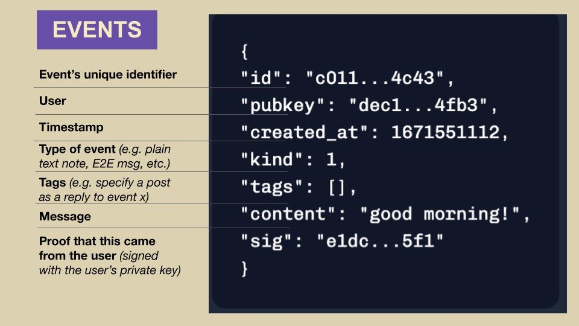
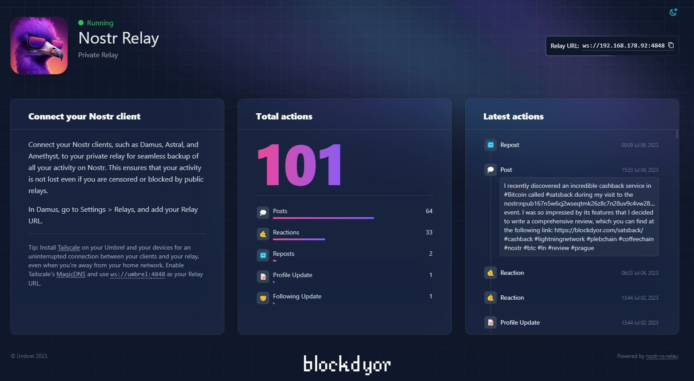

What is Nostr?
---

- A decentralized protocol for sending and receiving signed messages  
- Stands for *Notes and Other Stuff Transmitted by Relays*  
- Built on simple JSON messages, signed with private keys  
- Uses WebSockets for communication between clients and relays  
- No central server or company — anyone can run a relay  
- Identities are cryptographic (`private key` → `public key` → `npub` ⇄ `NIP-05 username`)
- Extensible through NIPs (Nostr Improvement Proposals)  
- Resistant to censorship, manipulation, and deplatforming  

<!-- column_layout: [2, 3] -->

<!-- column: 0 -->
> [!Note]
> All data is represented as signed **events** (notes, DMs, zaps, etc.)
<!-- column: 1 -->

[](https://github.com/nostr-protocol/nostr)

<!-- end_slide -->

Why Nostr? (NOSTR vs Conventional Social Media)
---

| Feature                     | Nostr                                 | Conventional Social Media          |
|----------------------------|----------------------------------------|------------------------------------|
| **Ownership**              | User owns keys and content             | Platform owns user data            |
| **Censorship Resistance**  | Decentralized, no central authority    | Centralized moderation and bans    |
| **Interoperability**       | Any client can access the same data    | Walled gardens, closed platforms   |
| **Account Creation**       | No signup, just a keypair              | Requires email/phone verification  |
| **Identity**               | Based on public keys                   | Based on platform accounts         |
| **Data Storage**           | Distributed via relays                 | Stored on company servers          |
| **Monetization**           | Native Lightning support (zaps)        | Ads, data sales                    |
| **Protocol Openness**      | Fully open and extensible via NIPs     | Proprietary APIs and features      |
| **Client Freedom**         | Use or build any client                | Forced to use official apps        |
| **Relay Control**          | Users can choose or run their own      | No control over platform servers   |

<!-- column_layout: [2, 3] -->

<!-- column: 0 -->
> [!Caution]
> Social media platforms are centralized, controlled by companies, and often censor content, banning user accounts that don't yield to their politically influenced policies.

<!-- column: 1 -->


[](https://pixabay.com/illustrations/social-media-internet-security-1679307/)

<!-- end_slide -->

Core Concepts
---

- **Events**: the basic unit of data (text, metadata, actions)  
  - Examples:
    - Text notes
    - Metadata updates  
    - Encrypted messages  
    - Follows and reactions

- **Clients**: apps that create and read events  
  - Examples:
    - Damus (iOS)  
    - Amethyst (Android)  
    - Snort (Web)  
    - Coracle (Web)

- **Relays**: servers that broadcast and store events  
  - Examples:
    - relay.damus.io  
    - nostr.wine  
    - relay.snort.social

- **NIPs**: Nostr Improvement Proposals to standardize features  
  - Examples:
    - NIP-01: Event formats  
    - NIP-05: Human-readable names  
    - NIP-07: Signing via browser extensions

<!-- end_slide -->

How to Get Started
---

- Generate a keypair: pubkey = identity, privkey = signing
- Choose a client:

  - Mobile: [Damus](https://damus.io), [Amethyst](https://amethyst.social)
  - Web: [Iris](https://iris.to), [Snort](https://snort.social)
- Post your first event (usually a `kind:1` note)
- Add relays in your client config

🔑 [Nostr Key Tools](https://njump.me/)

<!-- end_slide -->

What Are Events?
---

<!-- column_layout: [2,3] -->

<!-- column: 0 -->
- Repo  : [](https://github.com/nostr-protocol/nips#event-kinds)
- JSON objects signed with your private key
- Basic structure:

```json +line_numbers
{
  "id": "...",
  "pubkey": "...",
  "created_at": 1234567890,
  "kind": 1,
  "tags": [],
  "content": "hello nostr!",
  "sig": "..."
}
```

- **Kind** values:

  - `0`: metadata
  - `1`: text note
  - `3`: contacts
  - `4`: encrypted DMs

<!-- column: 1 -->
> [!Note]
>
> - An unsigned Nostr event lacks a valid sig field.
> - Relays reject unsigned events as per NIP-01.
> - The sig proves authorship and is computed over the event id.
> - The id is the SHA-256 hash of a JSON-serialized array:[0, pubkey, created_at, kind, tags, content].
> - Unsigned events are sometimes used temporarily before signing.


[](https://seha.cc/nostr-101/)
<!-- end_slide -->

Clients
---

- Interfaces that interact with Nostr relays
- Generate and manage keypairs (private/public keys)
- Publish signed events (e.g. notes, metadata, contact lists)
- Subscribe to filters and read events from multiple relays
- Handle encrypted DMs via NIP-04
- Render content from tagged events (images, links, zaps)
- Validate and verify event signatures
- Maintain relay connections over WebSocket
- Support NIP-05 for human-readable usernames
- Enable zap requests and LN payments via NIP-57
- Use NIP-07 for browser extension key signing
- Display reposts and threaded replies
- Handle reactions (likes, zaps, reposts)
- Implement Nostr Wallet Connect (NIP-47)
- **Examples**:

  - [Damus](https://damus.io) – iOS
  - [Amethyst](https://amethyst.social) – Android
  - [Snort](https://snort.social) – Web
  
> [!Note]
> Clients are interchangeable thanks to standardized event formats

<!-- column_layout: [2, 3] -->
<!-- column: 0 -->


source: [](https://github.com/nostrdata/clients)

<!-- column: 1 -->


source: [](https://www.nobsbitcoin.com/primal-added-search-functionality/)
<!-- end_slide -->

Relays
---

- Repo  [NIP-11 Relay metadata]: <https://github.com/nostr-protocol/nips/blob/master/11.md>
- Relays are servers that transmit Nostr events between clients.
- They use **WebSocket** connections to receive and send events.
- Relays are **dumb**: they don’t judge or censor content (by default) but they do perform minimal event validation.  
- Events are pushed by clients (`EVENT`) and retrieved via subscriptions (`REQ`).
- Relays can **filter**, **store**, or **ignore** events based on policies.
- Clients can connect to multiple relays simultaneously.  
- No central server — anyone can run a relay.
- Examples:

  - `wss://relay.damus.io`  
  - `wss://nos.lol`  
  - `wss://relay.nostr.band`  
  - `wss://nostr.wine`  
  - `wss://nostr.mom`  
  - `wss://nostr-pub.wellorder.net`

<!-- column_layout: [1, 3, 1] -->
<!-- column: 1 -->


[](https://apps.umbrel.com/app/nostr-relay)
<!-- end_slide -->

Nostr Wallet Connect (NWC)
---

- Repo  : [](https://github.com/nostr-protocol/nips/blob/master/47.md)
- A protocol for interacting with Lightning wallets via Nostr events  
- Lets clients (e.g. apps) request payments or invoices from user's wallet  
- Built using regular Nostr events (e.g. `kind:23194` for payment requests)

# How It Works

- User links their wallet (e.g. Alby, Mutiny) to a Nostr identity  
- App/client sends an event to the wallet's pubkey with payment request  
- Wallet responds with invoice or confirms payment

# Use Cases

- Tipping content creators
- Pay-to-unlock content
- Microtransactions for access/features

# Supported Wallets

- [Alby](https://getalby.com)
- [Mutiny Wallet](https://mutinywallet.com)
- [Zeus](https://zeusln.app) (experimental)

<!-- end_slide -->

NIPs (Nostr Improvement Proposals)
---

- Repo : [github.com/nostr-protocol/nips](https://github.com/nostr-protocol/nips)
- NIPs = Specs that define how features work in Nostr
- Community-driven; propose new standards
- Examples:

  - NIP-01: Event formats
  - NIP-05: Human-readable names
  - NIP-07: Browser extension signing

<!-- end_slide -->

NIP-01 Deep Dive
---

- Repo  :[](https://github.com/nostr-protocol/nips/blob/master/01.md)
- Defines core event structure
- Required for client/relay interoperability
- Fields:

```text +line_numbers
{
 "id": <32-bytes lowercase hex-encoded sha256 of the serialized event data>,
 "pubkey": <32-bytes lowercase hex-encoded public key of the event creator>,
 "created_at": <unix timestamp in seconds>,
 "kind": <integer between 0 and 65535>,
 "tags": [
   [<arbitrary string>...],
   // ...
 ],
 "content": <arbitrary string>,
 "sig": <64-bytes lowercase hex of the signature of the sha256 hash of the serialized event data, which is the same as the "id" field>
}
```

<!-- column_layout: [2,1,2] -->
<!-- column: 0 -->
# Client -> Relay (Request)

- Communication via WebSocket.
- Clients connect to relay endpoints; one WebSocket per relay.
- Client messages (JSON arrays):
  - `["EVENT", <event>]` — publish event
  - `["REQ", <subscription_id>, <filters1>, ...]` — request/subscribe
  - `["CLOSE", <subscription_id>]` — end subscription
- `<subscription_id>`: unique per connection, string, max 64 chars.
- `<filtersX>`: JSON object for filtering (ids, authors, kinds, tags, time range, limit).
- Multiple filters in `REQ` = OR; multiple conditions in filter = AND.

<!-- column: 1 -->
<!-- new_lines: 5 -->

<!-- new_line -->


<!-- column: 2 -->
# Relay -> Client (Response)

- Relay messages (JSON arrays):
  - `["EVENT", <subscription_id>, <event>]` — send event to client
  - `["OK", <event_id>, <true|false>, <message>]` — accept/deny event
  - `["EOSE", <subscription_id>]` — end of stored events
  - `["CLOSED", <subscription_id>, <message>]` — server closed subscription
  - `["NOTICE", <message>]` — human-readable message/error
- `EVENT` uses valid subscription IDs only.
- `OK` always replies to `EVENT`, indicates accept/deny.
- `CLOSED` replies to `REQ` if refused or relay ends subscription.
- Standard error prefixes: duplicate, pow, blocked, rate-limited, invalid, restricted, error.
<!-- end_slide -->

Next Steps
---

- Try a client and post your first event
- Contribute to:

  - A NOSTR client you like
  - A  language impmentation of the NOSTR protocol

    - **Rust**: [](https://github.com/rust-nostr/nostr)
- Explore the NIPs repo to understand the protocol features
  - [](https://github.com/nostr-protocol/nips#event-kinds )
- Build a client using [nostr-tools](https://github.com/nbd-wtf/nostr-tools)
- Host your own relay for full sovereignty
- collection of NOSTR repos => [](https://github.com/aljazceru/awesome-nostr/blob/main/README.md)

<!-- end_slide -->
Thank you
---
<!-- column_layout: [1, 3, 1] -->
<!-- column: 1 -->
# 🚀 Welcome to censorship-resistant communication


source:[](https://sovryn.com/all-things-sovryn/introducing-nostr-a-decentralized-social-network-for-sovereign-individuals)
